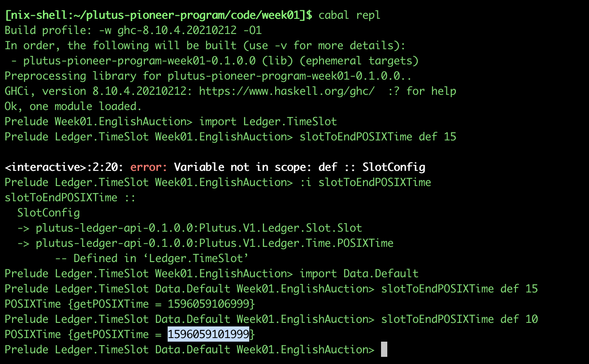
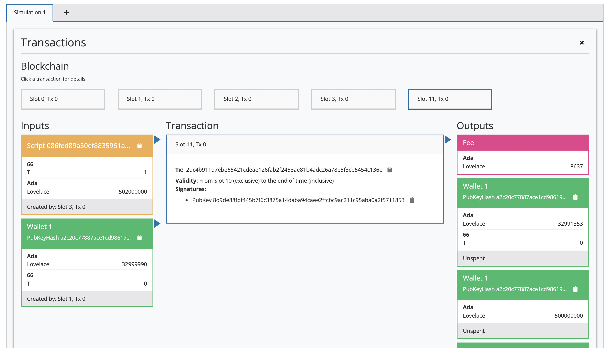

## Week One

#### Setting Up Nix

*This was somewhat challenging, as I am using MacOS 12.1 Monterey on an M1 RISC architecture.*

*There is a conversation on the discord channel where I rather embarrassingly can't quite figure out how I managed to configure nix in order to get both the server and client repositories to successfully build - we got there in the end though.*

Thanks to Renzwo (sorry, I can't remember your handle!): [https://github.com/renzwo/cardano-plutus-apps-install-m1](https://github.com/renzwo/cardano-plutus-apps-install-m1)

1. [Env Setup Video One](https://youtu.be/OB0OeveN6Ao)
2. [Env Setup Video Two](https://youtu.be/QVTmbi1U39Q)
3. [Env Setup Video Three](https://youtu.be/qyqfmYUqjP8)

```
cd ~/.

git clone https://github.com/input-output-hk/plutus-apps.git

git clone https://github.com/input-output-hk/plutus-pioneer-program.git

cd plutus-pioneer-program

cd code

cd week01

less cabal.project

/plutus-apps

# copy tag value

cd ~/plutus-apps

git checkout 41149926c108c71831cfe8d244c83b0ee4bf5c8a

nix-shell

# wait ...

cd ~/plutus-pioneer-program/code/week01

cabal build

cabal repl

# haddock documentation

cd ~/plutus-apps

build-and-serve-docs
```

#### Homework

**Documentation running on ```http://localhost:8002```**


**Server**


*Server seems to do this on Mac M1, will ask about / look for a fix soon.*

**Client**


**Playground**


**Playing on the playground**

A working example, similar to the one in the lecture:

Initial wallet balances:


Auction to simulate, there should be no issues here:


Calculating end of auction time:





Successful auction:


At slot one, wallet one owns T and balances reflect those outlined initially:


Logs:


At slot 11, things have changed:





Now we see that the transfer of ownership has taken place for the 'NFT':


**Something a LITTLE different**

Taking a quick look at the code:

```haskell
minLovelace :: Integer
minLovelace = 2000000
```

* Some kind of fee.
* Got sucked into reading codebase and doing some research.
* Ada.lovelaceValueOf: ```lovelaceValueOf :: Integer -> Value```
* ```newtype Ada = Lovelace { getLovelace :: Integer }```


Let's intentionally break this thing by providing a wallet with next to no Ada and trying to bid with less than 2 Ada, see wallet balances:


Little mistake, can you spot it?


Corrected:


Seems broken, right?


Yep:


Let's do some fixing, new wallet balances:


We're back:


*Spent a lot of time reading through parts of the codebase, trying to get a better understanding of both Plutus/Haskell and I am learning every day.*

#### Additional Notes

**Nix**

* Env management system (similar to conda, from what I understand)
* Consists of a package management solution and a 'language'
* Implements caching mechanisms (binary caching)
* Implements 'In-Network Caching'
* Manages dependency versions across teams using a shared network cache
* Expand upon this.

**Questions**

*These may potentially be answered before the Q&A. But I'll include them here anyway.*

* Regarding an accounts model vs a UTxO model - Does the limited scope of the eUTxO model mean that it's 'automatically protected' against race condition attacks (where transaction fees are driven up by an attacker)?
* Since we can know if a transaction will validate or not before pushing to chain/an SPO mempool, Is it possible for one address (wallet/user/contract) to push two (not yet validated) transactions to chain, such that the outputs of the first transaction act as inputs to the second transaction (and have them both validated within the same block)?
